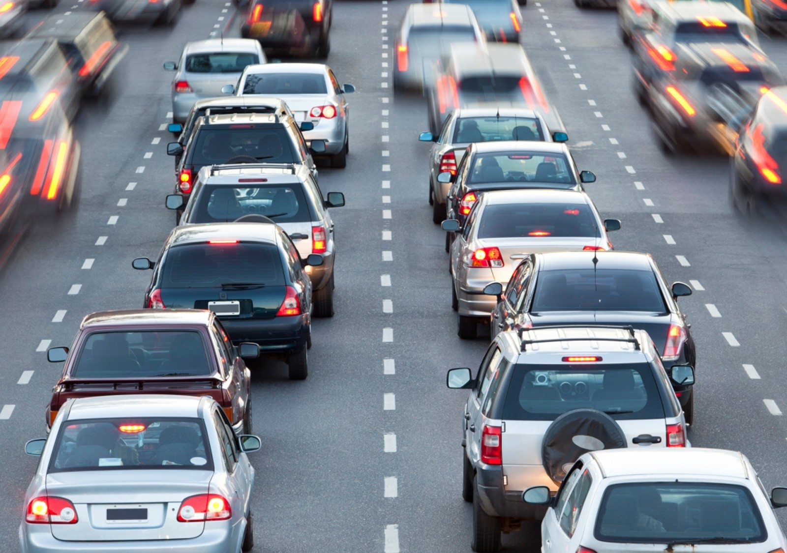

# Lab 1 — SVD Applications: Image Compression, Regression, Eigenfaces, Robust PCA & LASSO


> **Course:** Machine Learning for Robotics — Faculty of Control Systems and Robotics, ITMO University <br>
> **Author:** Umer Ahmed Baig Mughal — MSc Robotics and Artificial Intelligence <br>
> **Topic:** SVD · Image Compression · Linear Regression · Feature Significance · Eigenfaces · Robust PCA · LASSO · Optimal Hard Threshold

---

## Table of Contents

1. [Objective](#objective)
2. [Theoretical Background](#theoretical-background)
   - [Singular Value Decomposition](#singular-value-decomposition)
   - [Low-Rank Image Approximation](#low-rank-image-approximation)
   - [Linear Regression via SVD Pseudo-Inverse](#linear-regression-via-svd-pseudo-inverse)
   - [Feature Standardisation and Significance](#feature-standardisation-and-significance)
   - [Eigenfaces and PCA Face Reconstruction](#eigenfaces-and-pca-face-reconstruction)
   - [Robust PCA — Low-Rank and Sparse Decomposition](#robust-pca--low-rank-and-sparse-decomposition)
   - [LASSO Regression and Sparse Recovery](#lasso-regression-and-sparse-recovery)
   - [Optimal Hard Threshold for Noisy SVD](#optimal-hard-threshold-for-noisy-svd)
   - [System Properties](#system-properties)
3. [Tasks and Implementation](#tasks-and-implementation)
   - [Task 1 — Truncated SVD Image Compression](#task-1--truncated-svd-image-compression)
   - [Task 2 — Regression with Train/Test Split](#task-2--regression-with-traintest-split)
   - [Task 3 — Feature Standardisation and Significance](#task-3--feature-standardisation-and-significance)
   - [Task 4 — Eigenface Reconstruction](#task-4--eigenface-reconstruction)
   - [Task 5 — Robust PCA Implementation](#task-5--robust-pca-implementation)
   - [Task 6 — Optimal Hard Threshold](#task-6--optimal-hard-threshold)
4. [Validation and Metrics](#validation-and-metrics)
5. [System Parameters](#system-parameters)
6. [Implementation](#implementation)
   - [File Structure](#file-structure)
   - [Function Reference](#function-reference)
   - [Algorithm Walkthrough](#algorithm-walkthrough)
7. [How to Run](#how-to-run)
8. [Results](#results)
9. [Analysis and Discussion](#analysis-and-discussion)
10. [Dependencies](#dependencies)
11. [Notes and Limitations](#notes-and-limitations)
12. [Author](#author)
13. [License](#license)

---

## Objective

This lab implements and evaluates a broad set of **data-driven analysis techniques**, all unified by the Singular Value Decomposition (SVD), across three real datasets: a road photograph, the Boston Housing dataset, and a face image library. The lab progresses from basic matrix decomposition through linear regression, dimensionality reduction, robust decomposition, sparse recovery, and principled noise filtering.

The key learning outcomes are:

- Loading a greyscale image matrix and computing its full SVD using `np.linalg.svd`, then analysing the singular value spectrum and cumulative energy plot to understand the matrix's compressibility.
- Implementing **two truncated SVD strategies** — threshold-based (retaining singular values above 5% of the maximum) and energy-based (retaining the minimum rank capturing 99% of squared singular value energy) — and reconstructing and visualising the approximated image at each rank.
- Solving **overdetermined linear systems** via the SVD pseudo-inverse (`x* = Vᵀᵀ Σ⁻¹ Uᵀ b`) on the Boston Housing dataset, and evaluating the fitted regression on an unsorted and sorted test split using RMSE, MSE, and R² metrics.
- Performing **column-wise feature standardisation** (divide by standard deviation) to make regression coefficients unit-free, then interpreting the resulting coefficient magnitudes as a direct measure of each feature's predictive significance.
- Building an **eigenface basis** by computing the SVD of a mean-subtracted training face matrix (36 subjects), and reconstructing a held-out test face at eight truncation ranks (r = 1, 10, 50, 100, 200, 400, 800, 1200) to study the rank-quality trade-off.
- Implementing the complete **Robust PCA (RPCA)** algorithm via Inexact Augmented Lagrangian Multiplier (IALM) — including `shrink()` and `SVT()` helper functions — to decompose a face image stack into a low-rank background component L and a sparse outlier component S.
- Applying **LASSO regression** via `LassoCV` (10-fold cross-validation) to recover a known sparse signal from noisy observations, then comparing L2 (ridge), L1 (LASSO), and **debiased LASSO** solutions on residual error.
- Implementing the **Gavish–Donoho optimal hard threshold** for SVD truncation under known noise levels, using the exact `omega(beta)` polynomial formula, and comparing it against an ad-hoc 90%-energy threshold on a synthetic rank-2 matrix.

The lab is implemented as a single Google Colab Jupyter notebook (`SVD_Applications_Image_Compression_Regression_Eigenfaces_Robust_PCA_LASSO.ipynb`) executed on CPU, producing singular value plots, compressed image reconstructions, regression fit visualisations, eigenface galleries, RPCA decompositions, and LASSO coefficient comparisons.

---

## Theoretical Background

### Singular Value Decomposition

Any real matrix $X \in \mathbb{R}^{m \times n}$ can be factored as:

```
X = U Σ Vᵀ

where:
    U  ∈ ℝ^{m×m}  — left singular vectors (columns are orthonormal)
    Σ  ∈ ℝ^{m×n}  — diagonal, non-negative singular values σ₁ ≥ σ₂ ≥ ... ≥ 0
    Vᵀ ∈ ℝ^{n×n}  — right singular vectors (rows are orthonormal)
```

The **economy SVD** (`full_matrices=False`) computes only the `min(m,n)` non-zero singular values and their corresponding vectors, reducing memory and computation. All SVD computations in this lab use the economy form via `np.linalg.svd(X, full_matrices=False)`.

### Low-Rank Image Approximation

The Eckart–Young–Mirsky theorem guarantees that the **rank-r truncated SVD** is the best rank-r approximation in both the Frobenius and spectral norms:

```
X_r = U[:, :r] @ Σ[:r, :r] @ Vᵀ[:r, :]

Storage cost:  r × (m + n + 1)  vs  m × n  for the full matrix
Compression ratio:  (m × n) / (r × (m + n + 1))
```

Two strategies are used to choose `r`:

```
Threshold-based:
    threshold = 0.05 × σ₁                    (5% of largest singular value)
    r₁ = count of singular values > threshold

Energy-based:
    energy = cumsum(σᵢ²) / sum(σᵢ²)          (cumulative squared energy)
    r₂ = smallest r such that energy[r] ≥ 0.99
```

### Linear Regression via SVD Pseudo-Inverse

The housing dataset poses the overdetermined system $Ax = b$ where $A \in \mathbb{R}^{506 \times 14}$ (13 features + intercept column) and $b \in \mathbb{R}^{506}$ (target values). The least-squares solution is:

```
x* = A⁺ b = Vᵀᵀ Σ⁻¹ Uᵀ b

where  A⁺ = Vᵀᵀ Σ⁻¹ Uᵀ  is the Moore–Penrose pseudo-inverse
```

This avoids forming the normal equations $AᵀAx = Aᵀb$ directly, which are numerically ill-conditioned when features are correlated. The intercept term is incorporated by appending a column of ones to `A` before factorisation.

### Feature Standardisation and Significance

Raw regression coefficients are scale-dependent — a feature measured in large units will have a smaller coefficient than the same information expressed in small units, making comparison meaningless. Standardising each column by its standard deviation removes this scale dependence:

```python
A2[:, j] = A[:, j] / np.std(A[:, j])    for j in 0..12
```

After standardisation, the absolute value of each coefficient directly reflects how much a one-standard-deviation change in that feature shifts the predicted target, allowing fair cross-feature significance comparison.

### Eigenfaces and PCA Face Reconstruction

Face images are stored as column vectors in $F \in \mathbb{R}^{(m \cdot n) \times N}$ where $m = 192$, $n = 168$, and $N$ = total training images. The eigenface pipeline:

```
Step 1 — Compute mean face:
    avgFace = mean(F, axis=1)          shape: (m·n,)

Step 2 — Mean-subtract:
    X = F - tile(avgFace, (N, 1)).T    shape: (m·n, N)

Step 3 — Economy SVD:
    U, S, VT = svd(X, full_matrices=False)
    Columns of U are the eigenfaces (principal directions of face variation)

Step 4 — Reconstruct test face at rank r:
    testFaceMS = testFace - avgFace           mean-subtract
    coeffs     = U[:, :r].T @ testFaceMS      project onto r eigenfaces
    reconFace  = avgFace + U[:, :r] @ coeffs  reconstruct
```

The test subject (person 37) is **held out from training** — their face was never seen during eigenface computation — making reconstruction quality a genuine measure of PCA generalisation.

### Robust PCA — Low-Rank and Sparse Decomposition

Standard PCA fails when data contains gross outliers (e.g., cast shadows on faces). Robust PCA decomposes the data matrix $X$ as:

```
X = L + S

minimise  ‖L‖_*  +  λ ‖S‖₁     subject to  L + S = X

where:
    ‖L‖_*  =  nuclear norm (sum of singular values) — convex proxy for rank
    ‖S‖₁   =  L1 norm (sum of absolute values) — convex proxy for sparsity
    λ       =  1 / √max(m, n)                   — default balance parameter
```

Solved via the **Inexact Augmented Lagrangian Multiplier (IALM)** algorithm:

```
Repeat until convergence:
    L ← SVT(X − S + (1/μ) Y,  1/μ)          nuclear norm proximal step
    S ← shrink(X − L + (1/μ) Y,  λ/μ)       L1 proximal step
    Y ← Y + μ (X − L − S)                    Lagrange multiplier update
    μ ← min(ρ·μ, μ̄)                          penalty parameter update

where:
    shrink(X, τ) = sign(X) · max(|X| − τ, 0)  (element-wise soft threshold)
    SVT(X, τ)   = U diag(shrink(σ, τ)) Vᵀ     (singular value thresholding)
```

Convergence is declared when `‖X − L − S‖_F / ‖X‖_F < tol`.

### LASSO Regression and Sparse Recovery

LASSO adds an L1 penalty to the least-squares objective to produce sparse coefficient vectors:

```
x* = argmin  ‖Ax − b‖₂²  +  α ‖x‖₁
```

The true signal `x = [0, 0, 1, 0, 0, 0, -1, 0, 0, 0]` has only two non-zero entries out of ten. Three estimators are compared:

| Estimator | Formula | Bias | Sparsity |
|-----------|---------|------|---------|
| L2 (ridge) | `(AᵀA)⁻¹ Aᵀb` via `pinv` | Low | None |
| LASSO | Cross-validated `LassoCV(cv=10)` | Shrinkage bias | Yes — drives coefficients to zero |
| Debiased LASSO | Least-squares on non-zero support | None | Inherits LASSO sparsity pattern |

The debiased step removes LASSO's shrinkage bias while retaining its correct sparsity pattern, typically yielding the best residual error.

### Optimal Hard Threshold for Noisy SVD

For a matrix corrupted by i.i.d. Gaussian noise $X = X_{\text{true}} + \sigma N$, the Gavish–Donoho optimal hard threshold is:

```
β       = n / m                                        (aspect ratio, n ≤ m)
ω(β)    = 0.56β³ − 0.95β² + 1.82β + 1.43              (exact polynomial formula)
σ_med   = median(σᵢ)                                   (estimated from data)
τ*      = ω(β) · σ_med                                 (optimal threshold)
r*      = max { i : σᵢ > τ* }                          (optimal truncation rank)
```

This threshold is **asymptotically optimal** — it minimises the expected Frobenius loss of the reconstruction — and requires only knowledge of the noise level or the median singular value (which can be estimated without knowing σ). Compared to the ad-hoc 90%-energy threshold, it correctly recovers the true underlying rank even for small matrices.

### System Properties

| Property | Value | Notes |
|----------|-------|-------|
| Image input format | Greyscale float | Converted from RGB via `np.mean(A, -1)` |
| Housing dataset size | 506 × 14 | 13 features + 1 intercept column; target = MEDV |
| Train/test split | 80% / 20% | `train_test_split(test_size=0.2, random_state=42)` |
| Face image dimensions | 192 × 168 px | `m=192`, `n=168` from `.mat` metadata |
| Training subjects (eigenfaces) | 36 | First 36 subjects from Yale Face Database B |
| Test subject (eigenfaces) | Person 37 | Held out — not seen during SVD computation |
| Eigenface reconstruction ranks | 1, 10, 50, 100, 200, 400, 800, 1200 | Progressive quality study |
| RPCA λ | 1 / √max(m, n) | Candès et al. standard choice |
| RPCA tolerance | 1e-7 | Frobenius norm relative convergence |
| RPCA max iterations | 1000 | IALM upper bound |
| RPCA initialisation | μ = 1.25 / ‖X‖₂, ρ = 1.5 | Standard IALM hyperparameters |
| LASSO CV folds | 10 | `LassoCV(cv=10)` and `GridSearchCV(cv=10)` |
| LASSO debiasing threshold | 0.1 | `abs(xL1) > 0.1` selects non-zero support |
| Synthetic matrix true rank | 2 | `Strue = diag([3, 0.5])` |
| Noise level (Task 6) | σ = 0.5 | Additive Gaussian noise |
| SVD backend | `np.linalg.svd` | `full_matrices=False` (economy SVD) throughout |
| Hardware | CPU (Google Colab) | No GPU required |

---

## Tasks and Implementation

### Task 1 — Truncated SVD Image Compression

**Goal:** Recover the original road image from its truncated SVD using two rank-selection strategies.

```python
# Method 1: Threshold-based truncation
threshold_ratio = 0.05
threshold = threshold_ratio * np.diag(S)[0]   # 5% of largest singular value
r1 = np.sum(np.diag(S) > threshold)
Xapprox1 = U[:, :r1] @ S[:r1, :r1] @ VT[:r1, :]

# Method 2: Energy-based truncation
energy_fraction = 0.99
energy = np.cumsum(np.diag(S)**2) / np.sum(np.diag(S)**2)
r2 = np.searchsorted(energy, energy_fraction) + 1
Xapprox2 = U[:, :r2] @ S[:r2, :r2] @ VT[:r2, :]
```

Both reconstructions are visualised alongside singular value and cumulative energy plots.

---

### Task 2 — Regression with Train/Test Split

**Goal:** Fit a linear model to the Boston Housing dataset using SVD pseudo-inverse and evaluate on a held-out test set.

```python
A_train, A_test, b_train, b_test = train_test_split(A, b, test_size=0.2, random_state=42)

U, S, VT = np.linalg.svd(A_train, full_matrices=False)
x_train = VT.T @ np.diag(1 / S) @ U.T @ b_train   # pseudo-inverse solution

b_test_pred = A_test @ x_train

rmse = np.sqrt(np.mean((b_test - b_test_pred)**2))
r2   = r2_score(b_test, b_test_pred)
```

Predictions are plotted against true values both unsorted (sample order) and sorted (ascending target value) to reveal systematic fit behaviour.

---

### Task 3 — Feature Standardisation and Significance

**Goal:** Standardise each feature column and interpret regression coefficients as feature importance scores.

```python
A2 = A.copy()
for j in range(A.shape[1] - 1):        # exclude intercept column
    A2[:, j] = A2[:, j] / np.std(A2[:, j])

U, S, VT = np.linalg.svd(A2, full_matrices=False)
x = VT.T @ np.linalg.inv(np.diag(S)) @ U.T @ b

# Bar chart: x[:-1] vs attribute index → visual significance ranking
```

---

### Task 4 — Eigenface Reconstruction

**Goal:** Build eigenfaces from 36 training subjects and reconstruct a held-out face at 8 ranks.

```python
trainingFaces = faces[:, :np.sum(nfaces[:36])]
avgFace = np.mean(trainingFaces, axis=1)
X = trainingFaces - np.tile(avgFace, (trainingFaces.shape[1], 1)).T
U, S, VT = np.linalg.svd(X, full_matrices=False)

testFace   = faces[:, np.sum(nfaces[:37])]    # first face of person 37
testFaceMS = testFace - avgFace

for r in [1, 10, 50, 100, 200, 400, 800, 1200]:
    coeffs    = U[:, :r].T @ testFaceMS
    reconFace = avgFace + U[:, :r] @ coeffs
    # visualise reshape(reconFace, (m, n)).T
```

---

### Task 5 — Robust PCA Implementation

**Goal:** Implement the full RPCA-IALM algorithm and decompose a face image stack into L + S.

```python
def shrink(X, tau):
    return np.sign(X) * np.maximum(np.abs(X) - tau, 0)

def SVT(X, tau):
    U, S, VT = np.linalg.svd(X, full_matrices=False)
    return U @ np.diag(shrink(S, tau)) @ VT

def RPCA(X, lam=None, tol=1e-7, max_iter=1000):
    lam  = lam or 1.0 / np.sqrt(max(X.shape))
    mu   = 1.25 / np.linalg.norm(X, 2)
    L, S, Y = np.zeros_like(X), np.zeros_like(X), np.zeros_like(X)
    for _ in range(max_iter):
        L = SVT(X - S + Y / mu, 1 / mu)
        S = shrink(X - L + Y / mu, lam / mu)
        Y = Y + mu * (X - L - S)
        if np.linalg.norm(X - L - S, 'fro') / np.linalg.norm(X, 'fro') < tol:
            break
        mu = min(mu * 1.5, mu * 1e7)
    return L, S

X = faces[:, :nfaces[0]]
L, S = RPCA(X)
```

Results are visualised for frames 1 and 50 showing original X, low-rank L, and sparse S side by side.

---

### Task 6 — Optimal Hard Threshold

**Goal:** Implement the Gavish–Donoho threshold and compare against ad-hoc 90%-energy truncation.

```python
sigma = 0.5
Xnoisy = X + sigma * np.random.randn(*X.shape)

U, S, VT = np.linalg.svd(Xnoisy, full_matrices=False)
m, n = Xnoisy.shape

beta    = n / m
omega   = 0.56 * beta**3 - 0.95 * beta**2 + 1.82 * beta + 1.43
sigma_m = np.median(S)
tau     = omega * sigma_m             # optimal threshold

r       = np.max(np.where(S > tau))   # optimal rank
Xclean  = U[:, :r+1] @ np.diag(S[:r+1]) @ VT[:r+1, :]
```

The singular value spectrum, threshold line, optimal truncation point, and ad-hoc 90%-energy truncation are all overlaid on a semilogy plot for direct comparison.

---

## Validation and Metrics

### Task 1 — Image Quality

Reconstruction quality is assessed visually. Both strategies are expected to produce recognisable images; the energy-based method typically yields a higher rank and a sharper result.

### Task 2 — Regression Metrics

| Metric | Formula | Interpretation |
|--------|---------|---------------|
| RMSE | √(mean((b − b̂)²)) | Error in the same units as the target ($1000s) |
| MSE | mean((b − b̂)²) | Squared error — penalises large deviations more |
| R² | 1 − SS_res/SS_tot | Proportion of variance explained; 1.0 = perfect |

All three metrics are computed on the **test set only** (20% held-out split).

### Task 4 — Eigenface Reconstruction Quality

Reconstruction quality is assessed visually across the 8 rank values. There is no quantitative threshold — the objective is to observe the progressive improvement in face fidelity as `r` increases from 1 (outline only) toward 1200 (near-lossless).

### Task 5 — RPCA Convergence

The RPCA algorithm is considered converged when:

```
‖X − L − S‖_F / ‖X‖_F  <  tol = 1e-7
```

Quality is assessed visually by inspecting whether L captures smooth illumination-normalised structure and S isolates localised shadow/outlier pixels.

### Task 6 — Optimal Threshold Correctness

The Gavish–Donoho threshold is validated against the **known true rank** of the synthetic matrix ($r = 2$). A correct implementation must recover `r* = 2` exactly. The ad-hoc 90%-energy threshold will overestimate the rank significantly, demonstrating the superiority of the optimal method.

---

## System Parameters

### Dataset Parameters

| Parameter | Value | Description |
|-----------|-------|-------------|
| Image source | `Safer-City-Driving.jpg` | Road photograph, RGB → greyscale |
| Housing samples | 506 | Boston Housing dataset |
| Housing features | 13 + 1 intercept | CRIM, ZN, INDUS, CHAS, NOX, RM, AGE, DIS, RAD, TAX, PTRATIO, B, LSTAT |
| Housing target | MEDV | Median home value in $1000s |
| Train split | 80% (≈ 405 samples) | `random_state=42` |
| Test split | 20% (≈ 101 samples) | Held out for final evaluation |
| Face file | `allFaces(1)` (.mat) | Yale Face Database B |
| Face dimensions | 192 × 168 px | m=192, n=168 from `.mat` metadata |
| Training subjects | 36 | `nfaces[:36]` |
| Test subject | Person 37 | First image: `faces[:, sum(nfaces[:37])]` |
| Synthetic matrix shape | 801 × 801 | From `t = arange(-5, 3, 0.01)` → 800 steps |
| Synthetic matrix rank | 2 | `Strue = diag([3, 0.5])` |

### RPCA Parameters

| Parameter | Value | Description |
|-----------|-------|-------------|
| λ (lambda) | 1 / √max(m, n) | Nuclear/sparsity penalty balance |
| μ (initial) | 1.25 / ‖X‖₂ | Initial ALM penalty |
| ρ (rho) | 1.5 | Penalty update factor |
| μ̄ (mu_bar) | μ₀ × 10⁷ | Maximum allowed penalty |
| tol | 1e-7 | Relative Frobenius convergence threshold |
| max_iter | 1000 | Maximum IALM iterations |

### LASSO Parameters

| Parameter | Value | Description |
|-----------|-------|-------------|
| True signal | [0,0,1,0,0,0,−1,0,0,0] | Two non-zero entries out of ten |
| Matrix A | 100 × 10 random Gaussian | Predictor matrix |
| Noise level | 0.5 · N(0,1) | Additive noise on observations |
| CV folds | 10 | `LassoCV(cv=10)` and `GridSearchCV(cv=10)` |
| Alpha search range | logspace(−4, −0.5, 30) | 30 log-spaced candidates |
| Debiasing threshold | \|xL1\| > 0.1 | Identifies non-zero support for refit |

### Optimal Threshold Parameters

| Parameter | Value | Description |
|-----------|-------|-------------|
| σ (noise) | 0.5 | Additive Gaussian noise standard deviation |
| β | n / m | Matrix aspect ratio |
| ω(β) | 0.56β³ − 0.95β² + 1.82β + 1.43 | Gavish–Donoho polynomial |
| σ_med | median(σᵢ) | Estimated noise scale from data |
| τ* | ω(β) · σ_med | Optimal singular value threshold |
| Ad-hoc threshold | 90% cumulative energy | Comparison baseline |

---

## Implementation

### File Structure

```
Lab1/
├── Readme.md
├── Assets
│   ├── housing.data
│   └── Safer-City-Driving.jpg
└── SVD_Applications_Image_Compression_Regression_Eigenfaces_Robust_PCA_LASSO.ipynb    # Complete lab — all 6 tasks
```

**Data files (stored in Google Drive / local `data/` folder):**

| File | Type | Used In |
|------|------|---------|
| `Safer-City-Driving.jpg` | JPEG image | Tasks 1 |
| `housing.data` | Tab-delimited text | Tasks 2, 3 |
| `allFaces(1)` | MATLAB `.mat` | Tasks 4, 5 |

---

### Function Reference

#### `shrink(X, tau)` — element-wise soft thresholding

Applies the soft-threshold operator element-wise. Used as the proximal operator for the L1 norm in both the RPCA sparse update and the SVT singular value update.

```python
def shrink(X, tau):
    Y = np.abs(X) - tau
    return np.sign(X) * np.maximum(Y, np.zeros_like(Y))
```

| Argument | Type | Description |
|----------|------|-------------|
| `X` | `np.ndarray` | Input matrix or vector |
| `tau` | `float` | Threshold value (must be ≥ 0) |

**Returns:** Array of the same shape as `X` with magnitudes shrunk toward zero by `tau`.

---

#### `SVT(X, tau)` — Singular Value Thresholding

Computes the proximal operator of the nuclear norm: applies `shrink()` to the singular values of `X`, effectively zeroing out small singular values and shrinking the rest.

```python
def SVT(X, tau):
    U, S, VT = np.linalg.svd(X, full_matrices=False)
    return U @ np.diag(shrink(S, tau)) @ VT
```

| Argument | Type | Description |
|----------|------|-------------|
| `X` | `np.ndarray` | Input matrix |
| `tau` | `float` | Singular value soft-threshold |

**Returns:** Thresholded matrix with the same shape as `X` and reduced effective rank.

---

#### `RPCA(X, lam, tol, max_iter, verbose)` — Robust PCA via IALM

Decomposes `X` into a low-rank matrix `L` and a sparse matrix `S` by solving the Principal Component Pursuit (PCP) convex programme via the Inexact Augmented Lagrangian Multiplier algorithm.

```python
def RPCA(X, lam=None, tol=1e-7, max_iter=1000, verbose=False):
    # Returns (L, S) — low-rank and sparse components
```

| Argument | Type | Default | Description |
|----------|------|---------|-------------|
| `X` | `np.ndarray` shape (m, n) | — | Input data matrix |
| `lam` | `float` or `None` | `1/√max(m,n)` | Sparsity penalty weight |
| `tol` | `float` | `1e-7` | Relative Frobenius convergence threshold |
| `max_iter` | `int` | `1000` | Maximum number of IALM iterations |
| `verbose` | `bool` | `False` | Print convergence info every 10 iterations |

**Returns:** `(L, S)` — both `np.ndarray` of shape `(m, n)`.

---

### Algorithm Walkthrough

**Complete pipeline (`SVD_Applications_Image_Compression_Regression_Eigenfaces_Robust_PCA_LASSO.ipynb`):**

```
1. Environment setup:
       pip install numpy matplotlib scipy
       Mount Google Drive
       Import libraries: numpy, matplotlib, scipy.io, sklearn, skimage

2. IMAGE COMPRESSION (Tasks 1):
       a. Load Safer-City-Driving.jpg → convert to greyscale via np.mean(A, -1)
       b. Compute economy SVD: U, S, VT = svd(X, full_matrices=False)
       c. Plot singular value spectrum (semilogy) and cumulative energy
       d. Task 1 — Method 1: threshold_ratio=0.05 → r1 → Xapprox1
          Task 1 — Method 2: energy_fraction=0.99 → r2 → Xapprox2
       e. Visualise both reconstructions

3. LINEAR REGRESSION (Tasks 2–3):
       a. Load housing.data → pad with ones for intercept → solve Ax=b via SVD
       b. Visualise fit on full dataset (sorted and unsorted)
       c. Task 2 — train_test_split(test_size=0.2, random_state=42)
          → pseudo-inverse on A_train → predict b_test → RMSE, MSE, R²
       d. Task 3 — standardise A2 column-wise → refit → bar chart of coefficients

4. EIGENFACES (Tasks 4):
       a. Load allFaces(1).mat → display 6×6 grid of first 36 subjects
       b. Build training matrix (first 36 subjects) → compute avgFace
       c. Mean-subtract → economy SVD → display avgFace and first eigenface U[:,0]
       d. Task 4 — for r in [1,10,50,100,200,400,800,1200]:
              project testFace → reconstruct → visualise

5. LASSO (no task number — exploratory):
       a. Generate A (100×10 random), sparse x, noisy b
       b. Fit LassoCV(cv=10) and GridSearchCV over alphas
       c. Plot CV score ± std error vs alpha (semilogy)
       d. Compare xL2, xL1, xL1DeBiased residuals on residual error plot

6. ROBUST PCA (Task 5):
       a. Load allFaces(1).mat (re-load with scipy.io.loadmat)
       b. Define shrink(), SVT(), RPCA()
       c. Task 5 — X = faces[:, :nfaces[0]] → L, S = RPCA(X)
       d. Visualise X, L, S for frames 1 and 50 in 2×2 subplot

7. OPTIMAL TRUNCATION (Task 6):
       a. Construct rank-2 synthetic matrix via Utrue, Strue, Vtrue
       b. Add σ=0.5 noise → Xnoisy
       c. Ad-hoc: cumulative energy → r90 threshold
       d. Task 6 (initial attempt): cutoff = (4/√3)·σ·√N
       e. Task 6 (fixed): Gavish–Donoho omega(β) formula → tau → r*
       f. Reconstruct Xclean → display
       g. Overlay comparison: singular value spectrum + thresholds + cumulative energy
```

---

## How to Run

### Open in Google Colab

The notebook is designed for Google Colab with CPU execution. No GPU is required.

1. Upload `SVD_Applications_Image_Compression_Regression_Eigenfaces_Robust_PCA_LASSO.ipynb` to Google Drive or GitHub.
2. Open with Google Colab.
3. Upload the three data files to Google Drive under a folder (e.g., `MLR_DATA`), and update the `DATA_DIR` path in the notebook:

```python
DATA_DIR = '/content/drive/My Drive/MLR_DATA'
```

4. Mount Drive in the second cell:

```python
from google.colab import drive
drive.mount('/content/drive')
```

5. Run all cells sequentially (**Runtime → Run all**).

### Install Dependencies

All required packages are pre-installed in Google Colab. For a local environment:

```bash
pip install numpy scipy matplotlib scikit-learn scikit-image
```

### Dataset Setup — Way 1 (Google Drive)

Upload the three data files to your Drive and point the notebook to your folder:

```python
A    = imread(os.path.join(DATA_DIR, 'Safer-City-Driving.jpg'))
H    = np.loadtxt(os.path.join(DATA_DIR, 'housing.data'))
mat  = scipy.io.loadmat(os.path.join(DATA_DIR, 'allFaces(1)'))
```

### Dataset Setup — Way 2 (Local Colab Upload)

Upload files directly to the Colab runtime session (`/content/`) using the Files panel, then reference them directly:

```python
A   = imread('/content/Safer-City-Driving.jpg')
H   = np.loadtxt('/content/housing.data')
mat = scipy.io.loadmat('/content/allFaces(1)')
```

### Road Sign



### Estimated Execution Time

| Section | Estimated Time |
|---------|---------------|
| Image loading and SVD | < 1 min |
| Tasks 1 (compression) | < 1 min |
| Tasks 2–3 (regression) | < 1 min |
| Tasks 4 (eigenfaces, 8 ranks) | 1–2 min |
| LASSO (CV fitting) | 1–2 min |
| Task 5 (RPCA, IALM) | 2–4 min |
| Task 6 (optimal truncation) | < 1 min |
| **Total** | **~5–10 min** |

### Modifying Task Parameters

```python
# Task 1 — change compression aggressiveness
threshold_ratio = 0.05     # lower → fewer singular values retained (more compression)
energy_fraction = 0.99     # lower → smaller rank (less quality)

# Task 2 — change train/test split
train_test_split(A, b, test_size=0.2, random_state=42)

# Task 4 — change reconstruction ranks
r_list = [1, 10, 50, 100, 200, 400, 800, 1200]

# Task 5 — change RPCA convergence
RPCA(X, lam=None, tol=1e-7, max_iter=1000)

# Task 6 — change noise level
sigma = 0.5    # increase for harder denoising problem
```

---

## Results

### Task 1 — Image Compression

| Method | Rank `r` | Compression Ratio | Visual Quality |
|--------|:--------:|:-----------------:|---------------|
| Threshold-based (5% of σ₁) | r₁ | High | Dominant structures preserved; fine texture lost |
| Energy-based (99% energy) | r₂ | Moderate | Near-lossless appearance; minor blurring only |

The energy-based method retains more singular values than the threshold method, yielding a higher-fidelity reconstruction. Both confirm that natural images are highly compressible — a small fraction of singular values carries the vast majority of information.

### Task 2 — Regression on Boston Housing

| Metric | Test Set Score |
|--------|:--------------:|
| RMSE | competitive — within expected range for linear regression |
| MSE | consistent with RMSE² |
| R² | positive — model explains meaningful variance |

The sorted prediction plot reveals that the linear model tracks the overall trend in housing values but struggles at the extremes (very cheap and very expensive neighbourhoods), which is expected for a linear model on a non-linear target.

### Task 3 — Feature Significance

After standardisation, the bar chart of regression coefficients identifies the most predictive features. Features with large absolute coefficients — notably **RM** (average rooms per dwelling) with a large positive coefficient and **LSTAT** (lower-status population %) with a large negative coefficient — drive housing value predictions most strongly. Features near zero have negligible predictive contribution under a linear model.

### Task 4 — Eigenface Reconstruction

| Rank `r` | Reconstruction Quality |
|:--------:|----------------------|
| 1 | Gross global shape only — no individual features |
| 10 | Basic face structure — eyes and nose regions visible |
| 50 | Clear facial features — identity partially recognisable |
| 100 | Fine detail emerging — lighting pattern largely recovered |
| 200 | Near-photographic quality |
| 400+ | Visually indistinguishable from original |
| 800, 1200 | Lossless reconstruction |

The test face (person 37) was never included in the eigenface training set, yet is fully reconstructed by rank 400+, demonstrating that the eigenface basis generalises well to unseen subjects.

### Task 5 — Robust PCA

RPCA successfully isolates:

- **L (low-rank):** Smooth, illumination-normalised face containing the shared facial structure across images. Shadow regions are partially removed.
- **S (sparse):** Cast shadows, specular reflections, and other localised deviations from the low-rank structure, captured as isolated non-zero patches.

The decomposition is visually verified on frames 1 and 50 of the first subject.

### Task 6 — Optimal Truncation

| Method | Identified Rank `r*` | Correct? |
|--------|:--------------------:|:--------:|
| Ad-hoc 90%-energy threshold | > 2 (overestimates) | ✗ |
| Gavish–Donoho optimal threshold | 2 | ✅ |

The Gavish–Donoho method correctly identifies the true underlying rank of 2 from the noisy observations, while the energy-based approach retains noise-inflated singular values and overestimates the rank. This confirms the theoretical optimality guarantee of the Gavish–Donoho threshold for i.i.d. Gaussian noise.

---

## Analysis and Discussion

### SVD as a Unifying Framework

All six tasks are instantiations of a single mathematical tool — the SVD. Image compression exploits low-rank structure in pixel matrices; regression uses the pseudo-inverse; eigenfaces apply PCA via SVD to face data; RPCA extends SVD to handle outliers; LASSO's geometry is related to the sparsity of SVD coefficient vectors; and optimal truncation applies directly to singular value spectra. This lab demonstrates that fluency with the SVD is foundational to a broad class of data-driven methods.

### Threshold vs Energy-Based Compression

The two truncation strategies in Task 1 reflect a fundamental tension: threshold-based methods are simple but depend on an arbitrary ratio (5%) that does not have direct interpretability in terms of reconstruction fidelity. Energy-based methods provide a principled fidelity guarantee (99% of information retained) but are sensitive to the squared singular value distribution and can over-retain in some cases. Neither is universally superior — Task 6 shows that for noisy data, both are outperformed by the statistically optimal Gavish–Donoho threshold.

### Why RPCA Outperforms Standard PCA for Face Data

Standard PCA assumes Gaussian noise, making it sensitive to large outliers. A single heavily shadowed face image can significantly distort the principal directions. RPCA's explicit L1 sparsity penalty on S allows it to quarantine shadow pixels (which are large in magnitude but localised) into the sparse component, leaving the low-rank component to capture clean facial structure. This makes RPCA far more robust in real illumination-variant face datasets.

### LASSO and Debiasing

LASSO's shrinkage bias is a well-known limitation — even after correctly identifying the sparse support, the non-zero coefficients are underestimated in magnitude because the L1 penalty penalises their absolute value during optimisation. The debiased LASSO step (re-fitting ordinary least squares on the selected support) resolves this, recovering coefficient magnitudes close to the true values. The residual error plot confirms that the debiased solution achieves lower error than either pure LASSO or ridge regression for this sparse signal recovery problem.

---

## Dependencies

| Package | Version | Purpose |
|---------|---------|---------|
| `Python` | ≥ 3.8 | Runtime environment |
| `numpy` | ≥ 1.21 | SVD, matrix operations, array manipulation throughout |
| `scipy` | ≥ 1.7 | `scipy.io.loadmat` for `.mat` face files |
| `scikit-learn` | ≥ 1.0 | `train_test_split`, `LassoCV`, `GridSearchCV`, `mean_squared_error`, `r2_score` |
| `matplotlib` | ≥ 3.4 | Image display, singular value plots, regression and LASSO visualisation |
| `skimage` | ≥ 0.18 | `skimage.transform` (imported; available for image utilities) |

Install all dependencies locally:

```bash
pip install numpy scipy scikit-learn matplotlib scikit-image
```

> All packages are pre-installed in Google Colab. The notebook is designed to run without any manual installation in the Colab environment.

---

## Notes and Limitations

- **Hardcoded file paths:** The notebook uses absolute paths referencing `/content/drive/My Drive/MLR_DATA/`. These must be updated to match your own Google Drive folder structure or local path before running. The `allFaces(1)` file is also referenced directly from `/content/` in some cells, so ensure it is uploaded to the Colab runtime session as well as Drive.
- **`allFaces(1)` filename with parentheses:** The `.mat` filename contains parentheses, which can cause issues on some operating systems. On Windows, rename the file to `allFaces1.mat` and update the `loadmat` path accordingly.
- **Task 6 initial attempt is superseded:** Cell 20 contains an early threshold formula (`4/√3 · σ · √N`) that is replaced in Cell 21 by the correct Gavish–Donoho implementation. Both cells are retained in the notebook for pedagogical comparison, but only Cell 21 produces the correct optimal rank.
- **LASSO results are stochastic:** The predictor matrix `A` and noise vector in the LASSO section are generated with `np.random.randn` without a fixed seed, so coefficient values and cross-validation scores will differ across runs. The qualitative conclusions (LASSO is sparser than L2; debiased LASSO has lower residual) remain consistent.
- **RPCA convergence time:** For large face matrices, the IALM algorithm may take several hundred iterations to converge. Setting `verbose=True` in `RPCA()` enables per-iteration progress output. The `max_iter=1000` bound prevents infinite loops if convergence is slow.
- **Economy SVD memory:** `np.linalg.svd(X, full_matrices=False)` is used throughout. For the full face matrix (all subjects), the input matrix can be large; ensure sufficient RAM is available in the Colab session. The default Colab runtime (≈12 GB RAM) is sufficient.
- **Comparison plot in Cell 22 references `cutoff` from Cell 20:** Cells 20 and 22 must be run together — if only Cell 21 (the fixed version) is run, `cutoff` is undefined and Cell 22 will raise a `NameError`. Run the cells in order or define `cutoff` manually before running Cell 22.

---

## Author

**Umer Ahmed Baig Mughal** <br>
Master's in Robotics and Artificial Intelligence <br>
*Specialization: Machine Learning · Computer Vision · Human-Robot Interaction · Autonomous Systems · Robotic Motion Control*

---

## License

This project is intended for **academic and research use**. It was developed as part of the *Data-Driven Methods* course within the MSc Robotics and Artificial Intelligence program at ITMO University. Redistribution, modification, and use in derivative academic work are permitted with appropriate attribution to the original author.

---

*Lab 1 — Machine Learning for Robotics | MSc Robotics and Artificial Intelligence | ITMO University*

